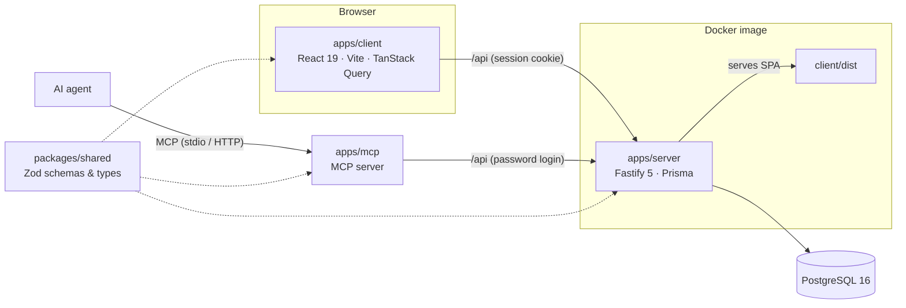

# todo

A password-protected personal planner for monthly goals and daily/weekly todos, with a browsable completion history and an MCP server so AI agents can manage the board.

```mermaid
flowchart LR
  subgraph browser["Browser"]
    client["apps/client<br/>React 19 · Vite · TanStack Query"]
  end

  agent["AI agent"] -- "MCP (stdio / HTTP)" --> mcp["apps/mcp<br/>MCP server"]

  subgraph monolith["Docker image"]
    server["apps/server<br/>Fastify 5 · Prisma"]
    static["client/dist"]
  end

  client -- "/api (session cookie)" --> server
  server -- "serves SPA" --> static
  mcp -- "/api (password login)" --> server
  server --> db[("PostgreSQL 16")]

  shared["packages/shared<br/>Zod schemas & types"] -.-> client
  shared -.-> server
  shared -.-> mcp
```
